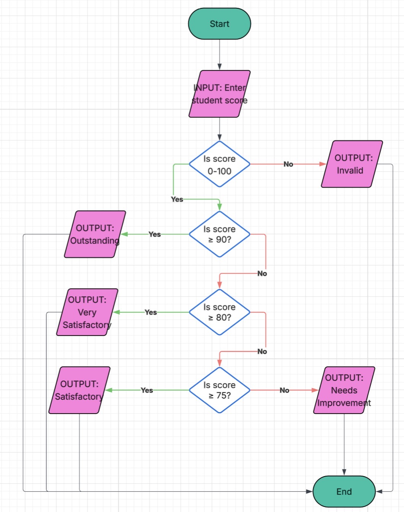

# **Improvised Student Score Checker**

## *Name: Zoe Naomi G. Arcilla*
## *Grade & Section: 8 Dahlia*

### **Activity Overview:**
 In this activity I learned how to improve a program by making it more organized and efficient. I also added necessary restrictions that were missing in the original code.
 The program is a Student Score Checker classifies grades as follows: a score of 90-100 is ‘Outstanding’, 80-89 is ‘Very Satisfactory’, 75-79 is ‘Satisfactory’. Any score below 75 (but greater or equal to 0) is classified as ‘Needs Improvement’.
 The acceptable input must be between 0-100, otherwise, the score is be classified as ‘Invalid’.

 ### **Part 1: Analyzing Logic**
 **Input:** What information does the program need?
>The numerical score number entered by the user.

**Boundaries:**
 
 What is the minimum valid score?
>The minimum valid score is 0.

What is the maximum valid score?
>The maximum valid score is 100.

**Possible Outputs:** What outcomes can the program produce?
>“Outstanding” for scores 90-100.
>“Very Satisfactory” for scores 80-89.
>“Satisfactory” for scores 75-19.
>“Needs Improvement” for scores lower than 75 that is greater or equal to 0.
>“Invalid” for scores greater than 100 and lower than 0.

**Selection Patterns:**

Which part uses a boundary condition?
>The part that makes sure the score is between 0-100.

Which part uses multiple decision paths?
>The step that picks the classification based on the score.

### **Part 2: Flowchart**
I created a flowchart that shows the logic of my program.
Here is the flowchart I made:

### Part 3: Pseudocode
START

DISPLAY “Enter student score:”

INPUT score

IF score <0 OR score > 100 THEN

DISPLAY “Invalid”

ELSE IF score >= 90 THEN

DISPLAY “Outstanding”

ELSE IF score >= 80 THEN

DISPLAY “Very Satisfactory”

ELSE IF score >= 75 THEN

DISPLAY “Satisfactory”

ELSE

DISPLAY “Needs Improvement”

END

### Part 4: Clean Code Implementation
Here is the code I created: [score_checker.py](score_checker.py)

### Part 5: Testing program

| Test | Input | Purpose | Expected Output | Actual Output | Result
| -------- | -------- | -------- | -------- | -------- | -------- |
| 1  | -1  | Below minimum  | Invalid| Invalid| Pass
| 2  | 0  | Minimum boundary  | Needs Improvement| Needs Improvement|Pass| 
|3| 74| Below Satisfactory boundary| Needs Improvement| Needs Improvement| Pass|
|4| 75| Satisfactory boundary| Satisfactory| Satisfactory|Pass|
|5| 80| Very Satisfactory boundary| Very Satisfactory| Very Satisfactory|Pass|
|6| 90| Outstanding boundary| Outstanding| Outstanding|Pass|
|7| 100| Maximum boundary| Outstanding| Outstanding|Pass|
|8| 101| Above Maximum| Invalid| Invalid|Pass|

**Testing Reflection:**
1. Why is it important to test values 0-100?
>It is important because 0 is the lowest possible score and 100 is the highest. Testing them proves the program works for all scores between them.
2. Why did you also test -1 and 101?
>To make sure the program can catch mistakes. It proved that numbers too low like -1 or too high like 101 will correctly show “Invalid”.
3. Which test help you understand the boundary conditions?
>Tests 1,2,7, and 8. They showed me exactly how the program handles the very edges of the allowed scores.
4. Did any of your test fail initially? If yes, what did you change in your program?
>Yes, -1 originally showed “Needs Improvement”, instead of “Invalid”. I fixed it by adding an or statement to properly block numbers outside the 0-100 range.

**Reflection:** 
1. How did selection structures make the program more useful?
>Selection structures let my programs make decisions. Instead of doing the exact same thing every time, the program can check the score you type in. It can then decide if the score is invalid or in any of the classifications based of my rules.   
2. How did proper comments and readable formatting improve your program?
>Good formatting and comments make my code clean and easy to fix. When my code is organized, I can find mistakes much faster.
3. Why is it useful to plan the program using a flowchart and pseudocode before writing the code?
>Planning first helps me figure out the steps before I start coding. It lets me map out the logic in English. This makes it easier to spot mistakes before I spend time typing real code.
